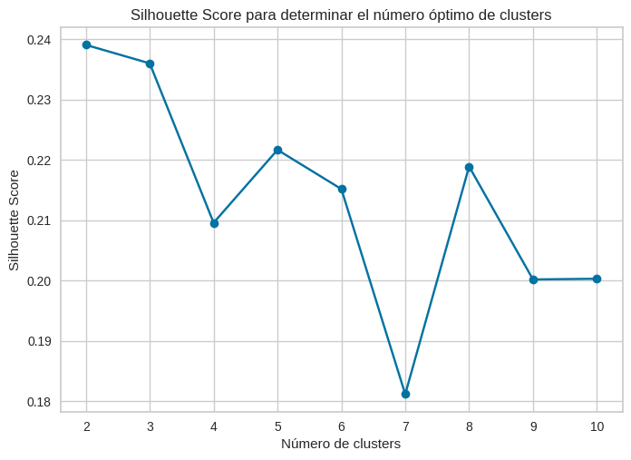
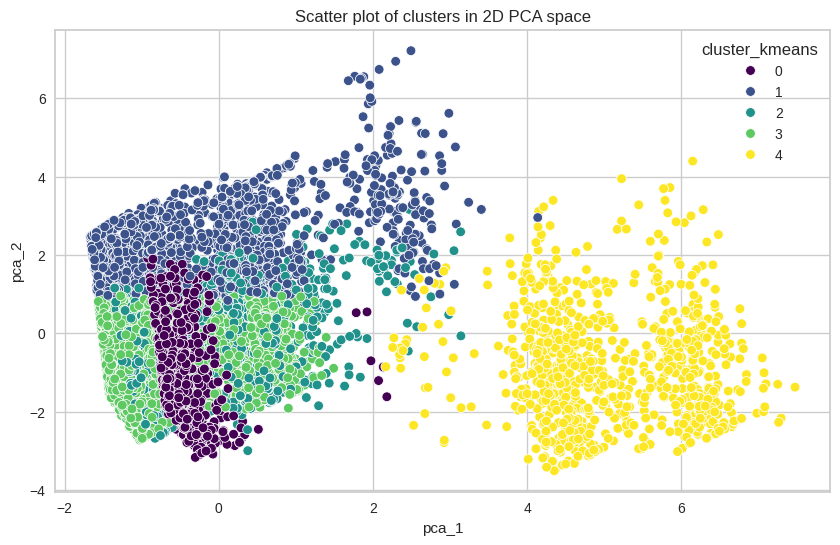

# Informe de Análisis de Datos para Segmentación de Clientes

## 1. Introducción a la Problemática

En el ámbito del comercio electrónico, comprender a fondo el comportamiento de los clientes es crucial para optimizar las estrategias de marketing y mejorar la experiencia del usuario. La segmentación de clientes permite agrupar a los usuarios en función de características y comportamientos similares, facilitando la personalización de campañas y la toma de decisiones estratégicas más acertadas.

El objetivo principal de este análisis es segmentar a los clientes del sitio web en grupos distintos en base a su comportamiento y características. Esta segmentación permitirá a la empresa diseñar campañas de marketing más efectivas y mejorar la retención de clientes.

## 2. Descripción del Proceso de EDA y Preprocesamiento de Datos

**2.1 Preprocesamiento de Variables**

**2.1.1 Variables Categóricas**

* **Cardinalidad y Frecuencias:** Se identificaron variables categóricas con un elevado número de categorías, muchas de ellas con frecuencias de muestra escasas. Se estableció un umbral mínimo de frecuencia del 1% para considerar una categoría como informativa. 

* **Selección de Categorías Relevantes:** Se aplicaron criterios para seleccionar las categorías relevantes, incluyendo la fusión de categorías similares y la eliminación de aquellas con baja representatividad.

    * **Fusión de Categorías:** Se fusionaron categorías con características similares o baja representatividad individual. Por ejemplo, las categorías "edge" e "internet explorer" dejando todo bajo el nombre de "internet explorer".

    * **Eliminación de Categorías:** Se eliminaron categorías que, a pesar de los esfuerzos de fusión, no cumplían con el criterio de representatividad mínima. En el caso de la variable "browser", se eliminaron las categorías "android", "opera" y "amazon" debido a su baja frecuencia.

* **Encoding:** Se aplicó encoding binario para convertir las variables categóricas en representaciones numéricas adecuadas para el análisis y modelado.

**2.1.2 Variables Numéricas**

* **Estandarización:** Se estandarizaron todas las variables numéricas para tener una media de 0 y una desviación estándar de 1.

* **Transformación Cíclica de la Hora:** Se transformó la variable "hora" utilizando una función seno para capturar su naturaleza cíclica.

* **Tratamiento de Outliers:** Se identificaron y trataron outliers en las variables numéricas utilizando la técnica de Winsorize.

**2.2 Consideraciones Adicionales**

* **Correlación entre Páginas Vistas e Interacciones:** Se observó una fuerte correlación entre las variables "páginas vistas" e "interacciones con la página", lo cual es esperable.

* **Completitud de la Información:** Se eliminó la variable "trafficsource.medium" debido a que presentaba información similar a "channelGrouping" y además, datos incompletos.

## 3. Metodología de Segmentación Utilizada

Para segmentar a los clientes, se utilizó la técnica de clustering particional K-means. Esta técnica agrupa los datos en un número predeterminado de clusters (K) en función de su similitud. Se evaluaron diferentes valores de K utilizando los métodos Elbow y Silhouette para determinar el número óptimo de clusters.

**Para mas detalles revisar el notebook N_Clustering**

**3.1 Estabilidad de los Clusters**

Para evaluar la estabilidad de los clusters obtenidos con el valor óptimo de K, se realizó bootstrapping con 100 iteraciones y se calculó el coeficiente de Jaccard. Un coeficiente de Jaccard medio superior al 70% indica una solución estable.

## 4. Resultados y Análisis de los Segmentos

El clustering obtenido con un K=5 y un coeficiente de Jaccard del 81% permitió identificar los siguientes segmentos de clientes:

**Para mas detalle sobre las graficas que implican este anlisis revisar el notebook N_Clustering**

**Segmento 0: Usuarios de Linux (Predominantemente Referencial)**

* **Características:** 
    * Dispositivos: Escritorio (predominantemente Linux)
    * Navegador: Chrome
    * Origen del tráfico: Referencial
    * Interacciones: 17 (media)
    * Páginas vistas: 14 (media)
    * Rebote: Bajo
    * Actividad: 15:00 (media)
    * Fin de semana: Baja presencia

**Estrategias de marketing:**

* Enfocarse en estrategias de marketing de referidos para aumentar la adquisición de nuevos clientes en este segmento.
* Implementar programas de fidelización para recompensar a los clientes leales y fomentar la retención.
* Desarrollar contenido personalizado y relevante para los intereses de este segmento.

**Segmento 1: Usuarios Orgánicos Altamente Interactivos**

* **Características:** 
    * Dispositivos: Escritorio (Windows y Macintosh)
    * Navegador: Chrome
    * Origen del tráfico: Orgánico
    * Interacciones: 43 (alta)
    * Páginas vistas: 33 (alta)
    * Rebote: Bajo
    * Actividad: 12:00 (media)
    * Fin de semana: alta presencia

**Estrategias de marketing:**

* Desarrollar una versión optimizada del sitio web para escritorio.
* Implementar campañas de marketing en redes sociales dirigidas a este segmento, especialmente durante los fines de semana.

**Segmento 2: Usuarios de Escritorio con Tráfico Directo**

* **Características:** 
    * Dispositivos: Escritorio (Windows y Macintosh)
    * Navegador: Chrome
    * Origen del tráfico: Directo
    * Interacciones: 16 (media)
    * Páginas vistas: 13 (media)
    * Rebote: Medio
    * Actividad: 15:00 (media)
    * Fin de semana: Baja presencia

**Estrategias de marketing:**

* Implementar campañas de remarketing para recapturar el interés de los usuarios que han visitado el sitio web anteriormente.
* Optimizar la página web para motores de búsqueda (SEO) para mejorar el posicionamiento en los resultados de búsqueda y atraer tráfico orgánico de este segmento.
* Ofrecer promociones y descuentos exclusivos para este segmento de clientes.

**Segmento 3: Usuarios de Macintosh (Predominantemente Referencial)**

* **Características:** 
    * Dispositivos: Escritorio (predominantemente Macintosh)
    * Navegador: Chrome
    * Origen del tráfico: Referencial
    * Interacciones: 14 (media)
    * Páginas vistas: 11 (media)
    * Rebote: Medio
    * Actividad: 15:00 (media)
    * Fin de semana: Presencia moderada

**Estrategias de marketing:**

* Fortalecer los programas de referidos para incentivar a los clientes existentes a recomendar el sitio web a sus amigos y familiares.
* Implementar campañas de email marketing personalizadas para este segmento.
* Ofrecer contenido exclusivo y de alta calidad para fidelizar a este segmento.

**Segmento 4: Usuarios Móviles de Fin de Semana**

* **Características:** 
    * Dispositivos: Móviles
    * Navegador: Chrome y Safari
    * Origen del tráfico: Orgánico
    * Interacciones: 17 (media)
    * Páginas vistas: 14 (media)
    * Rebote: Alto
    * Actividad: 12:00 (media)
    * Fin de semana: Alta presencia

**Estrategias de marketing:**

* Desarrollar una versión optimizada del sitio web para dispositivos móviles.
* Implementar campañas de marketing en redes sociales dirigidas a este segmento, especialmente durante los fines de semana.
* Ofrecer contenido atractivo y de fácil consumo para usuarios móviles.
